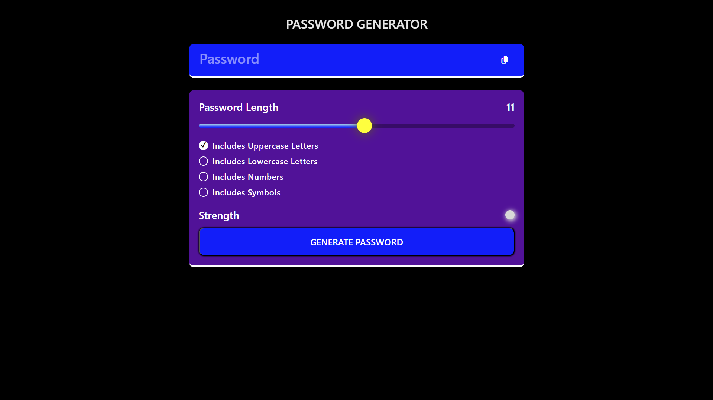

Here’s a simple addition to include a **Preview Screenshot** section in your README:

---

# Password Generator

A simple password generator that allows you to create secure passwords based on your selected criteria. The generated password can include uppercase letters, lowercase letters, numbers, and symbols. You can adjust the password length using a slider, and the strength of the password is indicated by a color. Additionally, you can copy the generated password to your clipboard.

---

## **Features**

- **Password Length Slider:** Adjust the length of the password.
- **Character Type Selection:** Choose whether the password should include uppercase letters, lowercase letters, numbers, and symbols.
- **Password Strength Indicator:** The strength of the password is visually indicated by a color.
- **Copy to Clipboard:** Copy the generated password with a single click.
- **Password Generation:** Click the generate button to create a new password based on the selected criteria.

---

## **How to Use**

1. **Select Character Types:**
   - Check the boxes for the character types you want in your password (uppercase, lowercase, numbers, symbols).
2. **Adjust Password Length:**
   - Use the slider to adjust the length of the password.
3. **Generate Password:**
   - Click the **"Generate"** button to generate a password based on your selected options.
4. **Copy Password:**
   - Click the **"Copy"** button to copy the generated password to your clipboard.

---

## **Technologies Used**

- **HTML**
- **CSS**
- **JavaScript**

---

## **Preview Screenshot**

Here is a preview of the password generator in action:

